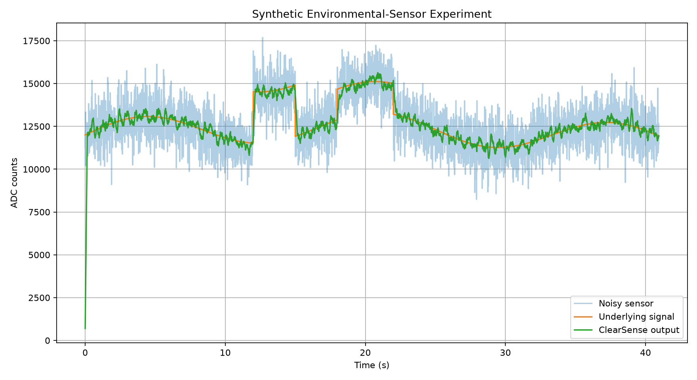
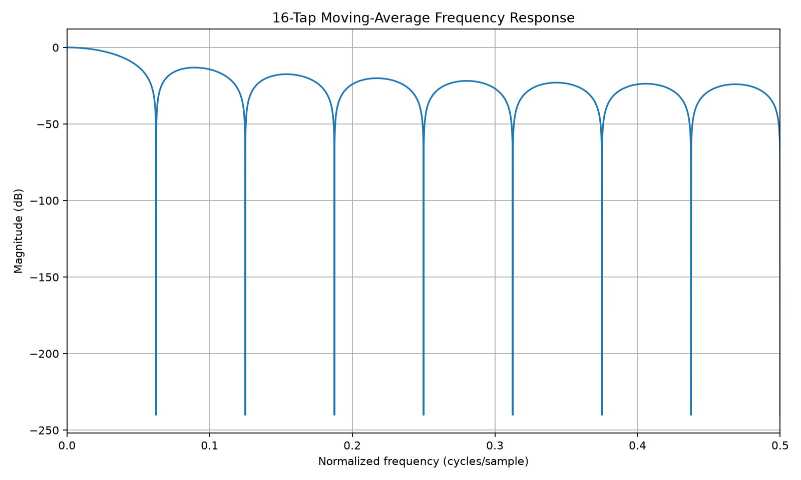

# ClearSense — Configurable FIR Sensor-Filter Accelerator

ClearSense is a configurable **SystemVerilog FIR filter accelerator** designed for environmental sensor processing and Digital IC/ASIC design exploration.

The project compares two hardware architectures:

- **Parallel MAC Architecture** — optimized for high throughput
- **Shared-Multiplier Architecture** — optimized for reduced hardware usage

## Project Objective

Environmental sensors can produce noisy measurements because of random noise, interference, and short disturbances.

ClearSense explores how dedicated digital hardware can perform real-time FIR filtering while studying the trade-off between:

**Throughput ↔ Hardware Resources ↔ Architecture**

## Features

- Parameterized FIR architecture
- Signed fixed-point arithmetic
- Programmable Q1.15 coefficients
- Symmetric rounding
- Output saturation
- Valid/Ready streaming interface
- Runtime coefficient programming
- Parallel and resource-shared implementations
- Self-checking SystemVerilog verification

## Verification Results

The design was tested across multiple widths, tap counts, and architectures.

- **12 configurations tested**
- **24,576 samples verified**
- **157,472 simulation cycles**
- **0 mismatches**

Test configurations include:

- 12-bit and 16-bit sample widths
- 4, 8, and 16 FIR taps
- Parallel architecture
- Shared-multiplier architecture

## Synthesis Results

For the **16-bit, 16-tap configuration**:

| Metric | Parallel | Shared |
|---|---:|---:|
| RTL Multiplier Operators | 16 | 1 |
| RTL Adder Operators | 17 | 4 |
| Generic Mapped Cells | 34,423 | 4,415 |
| Flip-Flop Cells | 513 | 572 |

The shared-multiplier architecture reduced the generic mapped cell count by approximately **87.17%**, while trading throughput for lower hardware usage.

## Sensor Noise Experiment

A deterministic environmental sensor experiment containing **4,096 samples** was used to evaluate filtering performance.

Results:

- Input residual-noise RMS: **957.282 counts**
- Output residual-noise RMS: **240.766 counts**
- Residual-noise reduction: **11.989 dB**

## Tools & Technologies

- SystemVerilog
- RTL Design
- Digital IC Design
- FIR Filtering
- Fixed-Point Arithmetic
- Icarus Verilog
- Yosys
- Python
- NumPy
- Matplotlib
- ASIC Design
- OpenLane

## Repository Structure

```text
ClearSense-FIR-Accelerator/
│
├── rtl/          # SystemVerilog RTL source files
├── tb/           # Verification testbench
├── scripts/      # Analysis and synthesis scripts
├── results/      # Verification and synthesis results
├── docs/         # Technical documentation
├── openlane/     # Physical-design configuration
├── Makefile
├── README.md
└── LICENSE
```

## Experimental Results

ClearSense was evaluated using a simulated environmental-sensor signal containing noise and interference. The generated results demonstrate the filtering behavior of the FIR accelerator.

### Sensor Noise Reduction

- Input residual-noise RMS: **958.150 counts**
- Output residual-noise RMS: **288.377 counts**
- Residual-noise reduction: **10.429 dB**
- Approximate RMS noise-amplitude reduction: **69.9%**



### FIR Frequency Response

The frequency-response analysis illustrates the filtering characteristics of the implemented FIR configuration.



## Hardware Architecture Comparison

Yosys synthesis was used to compare the two ClearSense RTL architectures.

| Architecture | Multipliers | Adders | Total Cells | Design Goal |
|---|---:|---:|---:|---|
| Parallel MAC | 16 | 17 | 117 | High parallelism / throughput |
| Shared Multiplier | 1 | 4 | 131 | Reduced multiplier usage |

The parallel architecture instantiates **16 multipliers**, allowing FIR operations to be performed with substantial parallelism. The resource-shared architecture reduces this to **a single multiplier** and reuses it across operations, requiring additional multiplexing and control logic.

These synthesis results demonstrate the architectural trade-off between arithmetic-resource usage and parallel computation. Exact silicon area, power consumption, and maximum clock frequency are not claimed because the current results are based on generic Yosys synthesis rather than technology-mapped ASIC implementation.

## Verification and CI

The project includes an automated GitHub Actions flow that performs:

- SystemVerilog RTL regression
- Self-checking functional verification
- Yosys synthesis
- Sensor-noise analysis
- Automatic generation of analysis artifacts

This provides a reproducible flow from RTL verification through synthesis and signal-processing analysis.
